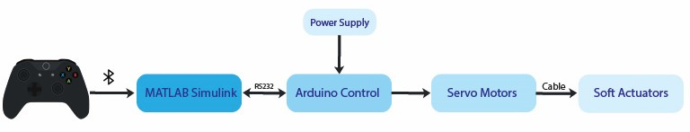
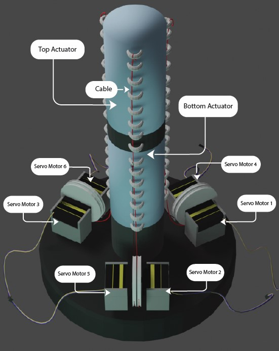
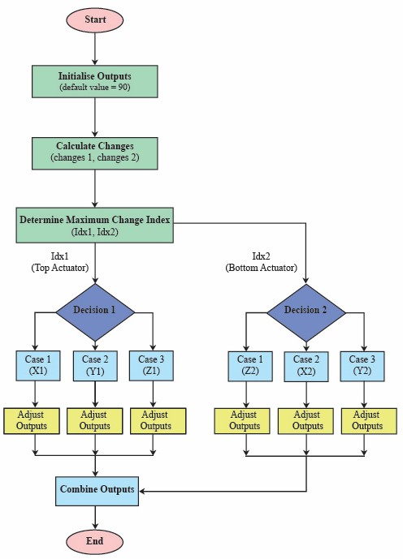
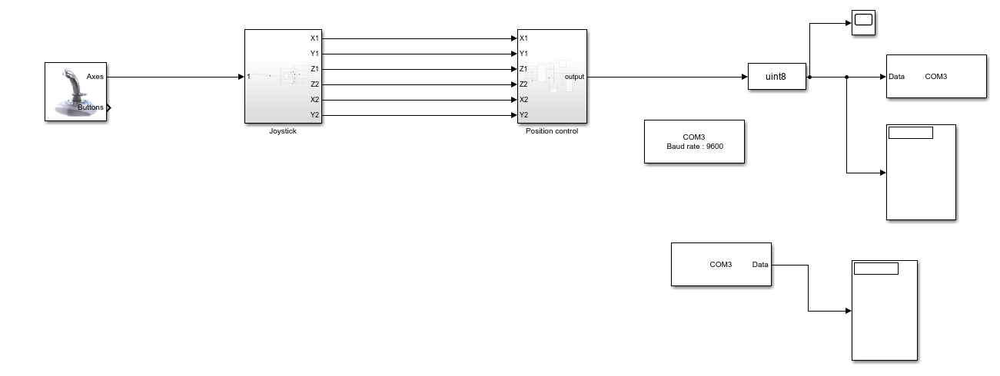
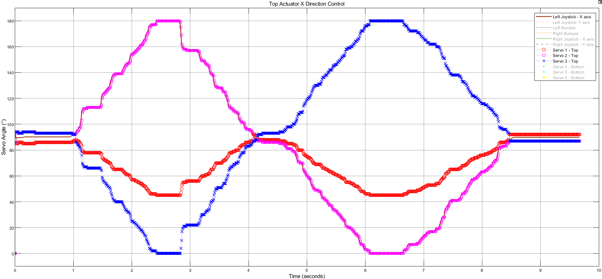

# Control System for a 6-DOF Soft Robotic Actuator for Medical Robotics

## Overview
This repository presents the research work from my MSc Biomedical Engineering project at the University of Dundee.

The project focuses on designing and developing a control system for a **six-degree-of-freedom (6-DOF) soft robotic actuator**, intended for applications in **medical robotics such as colonoscopic navigation and minimally invasive surgical tools**.

Soft robotic systems provide safer interaction with biological tissues and enable flexible movement inside constrained environments.

---

## Project Poster

A visual summary of the research project is available below.

📄 **Project Poster:**  
[View Project Poster](./project_poster.pdf)

---

## Research Problem
Traditional rigid robotic systems have limited flexibility and adaptability when operating in confined medical environments. Soft robotic actuators provide greater compliance and safety, but controlling multiple actuators simultaneously introduces challenges such as:

- actuator coordination
- cable interference
- real-time control stability

This research investigates control strategies for managing a **multi-actuator soft robotic system**.

---

## System Architecture
The system architecture integrates hardware and software components to control the soft robotic actuator.

Control pipeline:

Xbox Controller → MATLAB Simulink → Arduino Controller → Servo Motors → Soft Actuator

The joystick input is processed in **MATLAB Simulink**, transmitted to **Arduino via serial communication**, and used to control the **servo motors that manipulate the actuator cables**.

---

## Soft Actuator Design
The robotic structure consists of **two vertically aligned soft actuators** providing six degrees of freedom.

Each actuator is controlled by **three servo motors**, allowing precise manipulation of the actuator through cable-driven bending mechanisms.

---

## Control Strategies
Two control methodologies were developed:

### Dependent Control
- Three servo motors controlled simultaneously by a single joystick input
- Additional joystick input required for the remaining actuators
- Cable interference effects observed

### Independent Control
- Single joystick input controls all six actuators
- Compensates for cable interference
- Provides more stable and coordinated motion

Control logic diagram:

---

## Simulink Model
The control algorithm was implemented and simulated using **MATLAB Simulink**.

The model processes joystick inputs, generates actuator control signals, and communicates with the Arduino controller.

---

## Results
The performance of the control system was evaluated by comparing:

- joystick input signals
- servo motor feedback signals

Simulation results demonstrate accurate translation of user inputs into actuator motion.

---

## Technologies Used
- MATLAB / Simulink
- Arduino microcontroller
- Serial communication interface
- Soft robotic actuator design
- Servo motor control
- Real-time signal processing

---

## Applications
The developed control system has potential applications in:

- colonoscopic robotic navigation
- minimally invasive surgical robots
- rehabilitation robotics
- soft robotic manipulation systems

---

## Future Work
Future development may include:

- physical implementation and experimental validation
- integration of sensor feedback systems
- advanced control algorithms
- improved actuator design

---
## Repository Contents

- Control system architecture and actuator design diagrams  
- MATLAB Simulink control model  
- Experimental actuator control results  
- Project research poster summarizing the work  
- Example implementation code available in the `code/` folder

---
## Author
**Tharmeekan Jegatheeswaran**  
MSc Biomedical Engineering  
University of Dundee  

Supervisor: Dr. Luigi Manfredi
